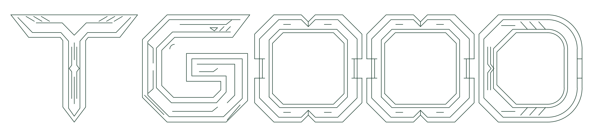

# YS1 机械 TGOOD 线条 Logo

加载本项目根目录的 `AA整合版本.lsp` 后输入 `YS1`，先指定直线起点，再指定终点。两点间生成绿色直线，图案包络框的中心位于第二点，保留第二点标高；图案保持当前 UCS 水平方向。两点重合时只生成图案，不创建零长度直线。

- 默认高度 80，总宽约 425.64；主体仅为 TGOOD。
- 沿用 YS 的当前图层、绿色、连续线型和一次 U 整体撤销规则。
- 图元为独立 LINE 和 ARC，不包含文字、字体、填充、块或图片；线段可单独编辑。
- 两个 O 共用同一几何函数，尺寸和细节完全相同，字母间留有独立间隙。
- 在 `c:YS1` 开头修改 `H` 即可等比例调整所有尺寸；字母宽度、间距、轮廓偏移和细节均从 H 派生。完成提示中的默认高度说明不参与几何计算。

源码离线预览：

验证命令：`python tools/check_all_static.py`、`python tools/check_ys1_static.py`。后者解释实际 LISP 几何构造，检查高度、平移、缩放和零长度边，并输出白底预览；生成预览需要 matplotlib。

本次仅做静态检查和离线几何预览，未连接 CAD，未在原生 ZWCAD 中加载或运行验证。
